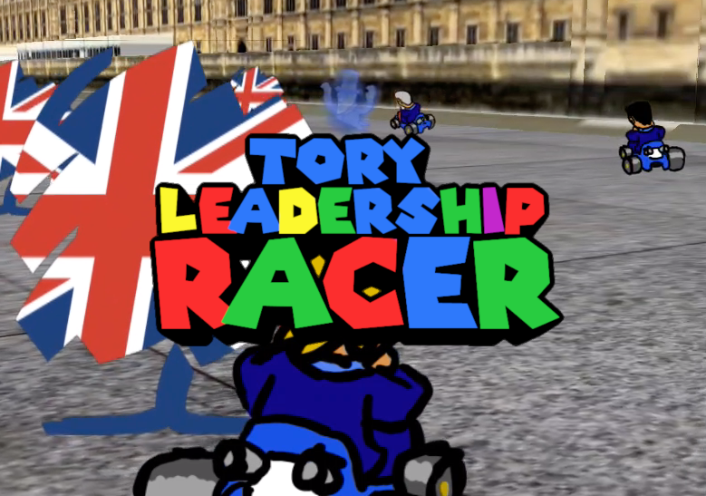

# Tory Leadership RACER!

A SNES-style kart-racer game based on the 2019 Tory leadership campaign by [Andrew](https://www.andrewt.net).

* Every lap, one contender is eliminated, [as per leadership campaign rules](https://www.bbc.co.uk/news/uk-politics-48395611).
* Don't drift too far right or else Jacob Rees-Mogg will glom onto you and scupper your chances.
* Don't drift too far left or you'll join Change UK and therefore be ineligible to win this (or any other) vote.

## Controls

On keyboard, A and D steer while S breaks; SHIFT is accelerate and SPACE selects a kart. Touch controls should appear on mobiles. Lastly you can also plug in an Xbox pad — then A accelerates and B brakes, the sticks control steering and camera (should you want that). A selects a kart.

## Build process

Copy the files onto the internet; it's a web page, why is it suddenly fashionable for them to have build processes?

## Open-source/CC credits

* Parliament model by [Damo](https://3dwarehouse.sketchup.com/user/0319491755264223266044156/Damo?nav=models), available from [3D Warehouse](https://3dwarehouse.sketchup.com/model/ee4e100e950bc57df8b758b99bd30e5b/Houses-of-Parliament)
* Music: "Wagon Wheel - Electronic" by Kevin MacLeod ([incompetech.com](http://incompetech.com)); licensed under [Creative Commons: By Attribution 3.0](http://creativecommons.org/licenses/by/3.0/)
* [Road texture](https://sftextures.com/2015/04/27/concrete-road-block-squared-black-and-white-marble-noisy-surface-texture/)
* 3D engine: [Three.JS](https://threejs.org/)
* [Background panorama](https://en.wikipedia.org/wiki/File:Trafalgar_Square_360_Panorama_Cropped_Sky,_London_-_Jun_2009.jpg)
* [Logo font](https://www.dafont.com/super-mario-256.font)
